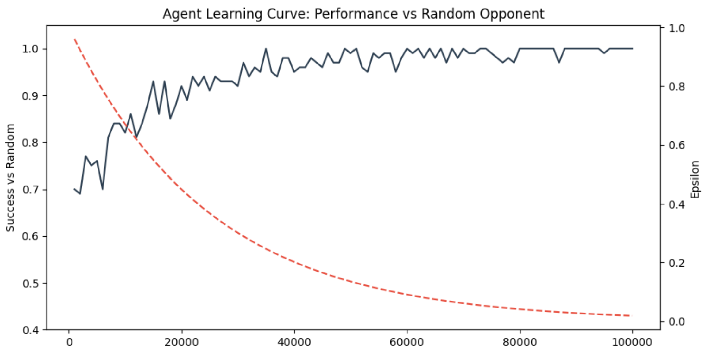

# Tic-Tac-Toe Reinforcement Learning
An unbeatable Q-Learning agent trained to solve the Tic-Tac-Toe state space through self-play and stochastic exploration.

<div align="center">
  <video src="https://github.com/user-attachments/assets/96770663-0c1d-48b7-9036-4d5372c49e73" width="400" controls muted autoplay loop>
    Your browser does not support the video tag.
  </video>
</div>

## 🚀 Overview
This project implements a **Tabular Q-Learning** agent that treats Tic-Tac-Toe as a Finite Markov Decision Process (MDP). Through 100,000 episodes of training, the agent transitions from random exploration to an optimal policy, eventually reaching a **Nash Equilibrium** where it is mathematically impossible to defeat.

## 🧠 Technical Implementation

### State-Space Normalization
To optimize convergence, I implemented a **Perspective-Agnostic State Representation**. Instead of tracking absolute 'X' and 'O' positions, the board is normalized based on the current actor:
* **1**: Current Player (Self)
* **-1**: Opponent
* **0**: Empty Cell

This approach effectively halves the state-space, allowing the agent to generalize winning patterns regardless of whether it plays as X or O.

### Dual-Update Training Pipeline
To maximize learning efficiency per episode, the training loop utilizes a **Dual-Update** method:
1. When a game ends, a reward is issued to the current player.
2. Simultaneously, a corresponding penalty or reward is backpropagated to the opponent's last state-action pair.

This results in a 2x increase in data points gathered per training game compared to standard single-agent updates.

### Exploration vs. Exploitation
The agent uses an **$\epsilon$-greedy strategy** with exponential decay.
* **Initial Phase**: High $\epsilon$ (exploration) ensures the agent discovers a wide variety of board states.
* **Final Phase**: Low $\epsilon$ (exploitation) allows the agent to solidify its optimal policy based on the Bellman Equation:
$$Q(s, a) \leftarrow Q(s, a) + \alpha [r + \gamma \max_{a'} Q(s', a') - Q(s, a)]$$

## 📊 Performance Analysis
The following graph tracks the **Success Rate** (Wins + Draws) against a random opponent during the training phase.



* **Baseline**: Starts at ~0.70 success rate (random play).
* **Convergence**: As $\epsilon$ (the red line) decays, the success rate climbs and stabilizes at **1.0 (100%)**.
* **Stability**: The consistency in the late stage indicates a robust Q-table that has successfully mapped the entire game tree.

## 🛠️ Installation & Usage

### Prerequisites
* Python 3.8+
* NumPy (for Q-table math)

### Setup
```bash
# Clone the repository
git clone [https://github.com/yourusername/TicTac-Toe-RL.git](https://github.com/yourusername/TicTac-Toe-RL.git)
cd TicTac-Toe-RL
```

# Install dependencies
pip install -r requirements.txt

# Play Against the AI
To test your skill against the trained agent in a clean CLI environment:
```bash
python play.py
```

# 📁 Project Structure
* src/agent.py: Contains the QLearningAgent class and logic.
* src/environment.py: The TicTacToe game engine and state-handling.
* models/: Contains the serialized q_table.pkl (the agent's brain).
* play.py: Main entry point for human-vs-AI gameplay.
* assets/: Contains training visuals and demo videos.

Created by Jordan Hunt, Senior Computer Science Undergraduate Specializing in AI
